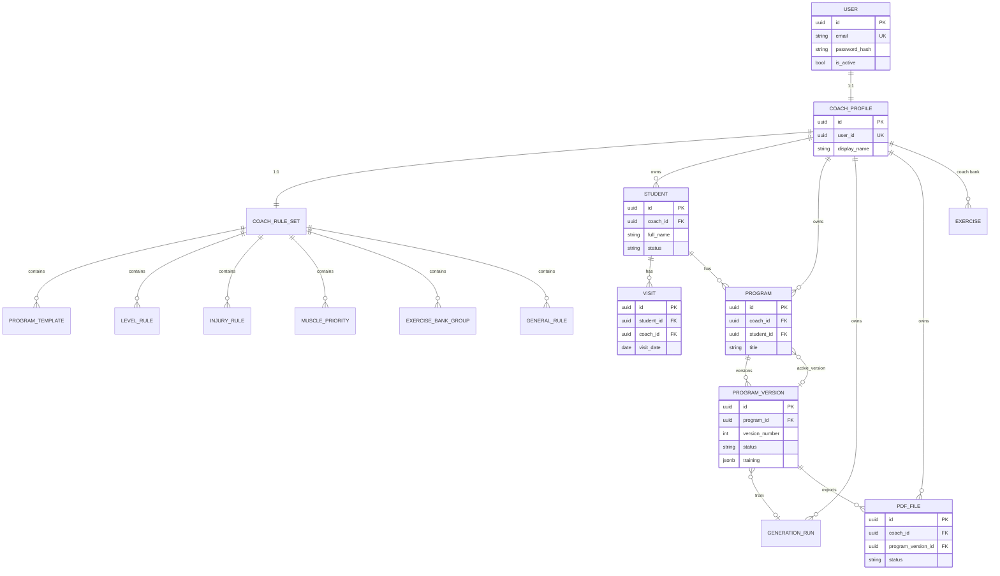

# Coach Assistant — Database Schema Design

**Status:** Design only (not implemented; no migrations in this phase)  
**Companion:** `domain-model.md` (canonical terms)  
**ORM target:** Django ORM on **PostgreSQL** (see §1)  
**Date:** 2026-08-06

---

## Canonical terms

Uses the terminology table in `domain-model.md`: Coach/CoachProfile, Student, Visit, Program, Program Version (`ProgramVersion`), Draft, Finalized, Duplicate, New Version, Generation Run (`GenerationRun`), PDF File (`PdfFile`).

---

## 1. Database engine choice

### Decision: PostgreSQL for all non-throwaway environments

| | |
|---|---|
| **Decision** | Use **PostgreSQL 16+** as the system of record for MVP/beta/prod. |
| **Rationale** | Multi-coach concurrency, JSONB + GIN if needed, robust constraints, future file metadata, safer auth token tables. SQLite prototype is insufficient for ownership-safe multi-user beta. |
| **Alternatives** | Keep SQLite only — acceptable for **local single-dev smoke**, not for shared staging. |
| **Consequences** | Docker Compose / managed Postgres in implementation phase; local `.env` `DATABASE_URL`. |

**SQLite:** May remain a **developer convenience** behind settings, but schema must be written for Postgres features we rely on (JSONB, UUID, partial unique indexes). Avoid Postgres-only features that block local SQLite *or* document that CI uses Postgres.

**Local warning:** Untracked `db.sqlite3` with Persian demo data must not drive schema design and must not be committed.

---

## 2. Cross-cutting conventions

| Convention | Rule |
|---|---|
| Primary keys | `UUID` (`uuid4`), exposed in API as strings |
| Ownership | Every tenant table has `coach_id` UUID FK → `coach_profiles.id` (except `users`, and pure join tables that inherit via parent) |
| Timestamps | `created_at` / `updated_at` timestamptz UTC; auto-maintained |
| Soft delete | Prefer `archived_at` / `deleted_at` on Student, Program, PDF where history matters; hard delete only empty drafts |
| Text | `UTF8`; store Persian in normal text/JSONB — no special encoding |
| Money | N/A |
| Decimals | Measurements: `numeric(6,2)`; percents: `numeric(5,2)` with checks 0–100 |
| Enums | DB check constraints or Postgres enums; Django `TextChoices` |
| JSON | JSONB with service-layer JSON Schema; optional `jsonschema` version column |
| IDs in JSON | Nested exercise/meal ids are **string UUIDs or client-stable ids** inside documents |

---

## 3. Normalized vs document data

| Kind | Examples | Queryable? |
|---|---|---|
| **Normalized operational** | users, coach_profiles, students core columns, visits, programs, program_versions meta, pdf_files, generation_runs meta, rule child tables | Yes — filters, ownership, lists |
| **JSON value objects** | student.goals, student.equipment, visit.measurements (optional columns preferred for measurements — see below) | Secondary |
| **JSON snapshots (immutable intent)** | program_versions.training/nutrition/supplements/pdf_settings; generation_runs.input_snapshot | Exact history; not primary filter targets |
| **Generator I/O** | Generation Run input/output JSON | Audit/debug |

**Body measurements:** Prefer **real columns** on `visits` for weight and key circumferences (dashboard/history charts). Keep optional extras in JSONB `extra_measurements` if needed.

---

## 4. ER diagram (logical)



---

## 5. Table specifications

Django app layout **recommendation** (implementation later): `accounts`, `students`, `coaching`, `programming`, `delivery` — names illustrative only.

### 5.1 `users` (Django auth / custom user)

| Column | Type | Null | Default | Notes |
|---|---|---|---|---|
| id | UUID PK | no | uuid4 | Prefer custom user with UUID |
| email | CITEXT/varchar(254) | no | | Unique; store normalized lower-case |
| password | varchar | no | | Django hasher |
| full_name | varchar(150) | no | | Registration display |
| is_active | bool | no | true | Deactivation |
| is_staff | bool | no | false | Admin |
| date_joined | timestamptz | no | now | |
| last_login | timestamptz | yes | | |

**Unique:** `email`  
**Ownership:** N/A  
**Soft-delete:** `is_active=false` preferred  
**Prototype:** Reuse Django User pattern — **change** to email-as-username custom user.

**P0 implementation note:** To preserve additive migration safety after `programs.0001_initial`, P0 keeps Django’s default `auth.User` (integer PK) and stores the normalized email in both `username` and `email`. `CoachProfile` and all product aggregates still use UUID primary keys. See `docs/p0-backend-implementation.md`.

### 5.2 `coach_profiles`

| Column | Type | Null | Default | Notes |
|---|---|---|---|---|
| id | UUID PK | no | | |
| user_id | UUID FK → users | no | | UNIQUE, ON DELETE CASCADE |
| display_name | varchar(120) | no | | Persian OK |
| style_notes | text | no | `''` | |
| control_mode | varchar(20) | no | `balanced` | check in (`strict`,`balanced`,`creative`) |
| default_session_minutes | int | no | 60 | check > 0 |
| created_at / updated_at | timestamptz | no | | |

**Ownership:** self via user  
**Delete:** CASCADE from user  
**Prototype:** replace `programs_coach`

### 5.3 `students`

| Column | Type | Null | Default | Notes |
|---|---|---|---|---|
| id | UUID PK | no | | |
| coach_id | UUID FK → coach_profiles | no | | ON DELETE CASCADE |
| full_name | varchar(120) | no | | |
| age | int | no | | check 10–100 (tune) |
| gender | varchar(16) | no | | `male`\|`female` |
| height_cm | numeric(5,1) | no | | |
| weight_kg | numeric(5,1) | no | | baseline; visits track history |
| phone_number | varchar(32) | yes | | |
| status | varchar(16) | no | `active` | `active`\|`inactive` |
| coach_notes | text | no | `''` | |
| goals | jsonb | no | `{}` | StudentGoal VO |
| injuries | jsonb | no | `{}` | StudentInjury VO |
| equipment | jsonb | no | `{}` | |
| lifestyle | jsonb | no | `{}` | |
| preferences | jsonb | no | `{}` | |
| training_background | jsonb | no | `{}` | |
| training_conditions | jsonb | no | `{}` | |
| summary_current_program_title | varchar(200) | no | `''` | denorm |
| summary_last_visit_date | date | yes | | denorm |
| summary_medical_note | varchar(300) | no | `''` | denorm |
| archived_at | timestamptz | yes | | soft archive |
| created_at / updated_at | timestamptz | no | | |

**Indexes:** `(coach_id, status)`, `(coach_id, full_name)`, GIN optional on goals JSON later  
**Unique:** none on phone globally; optional unique `(coach_id, phone_number)` where phone not null — **Open question**  
**Ownership:** `coach_id`  
**Prototype:** replace `StudentProfile`

### 5.4 `visits`

| Column | Type | Null | Default | Notes |
|---|---|---|---|---|
| id | UUID PK | no | | |
| coach_id | UUID FK | no | | denormalized ownership for simple RLS/queryset |
| student_id | UUID FK → students | no | | ON DELETE CASCADE |
| visit_date | date | no | | |
| current_weight_kg | numeric(5,1) | no | | |
| previous_weight_kg | numeric(5,1) | no | | |
| body_fat_percentage | numeric(5,2) | yes | | check 0–100 |
| waist_cm | numeric(6,2) | yes | | BodyMeasurement |
| chest_cm | numeric(6,2) | yes | | |
| arm_cm | numeric(6,2) | yes | | |
| thigh_cm | numeric(6,2) | yes | | |
| hip_cm | numeric(6,2) | yes | | |
| adherence_overall | numeric(5,2) | no | 0 | 0–100 |
| adherence_training | numeric(5,2) | no | 0 | |
| adherence_nutrition | numeric(5,2) | no | 0 | |
| adherence_supplements | numeric(5,2) | no | 0 | |
| daily_energy_level | varchar(16) | no | | VisitLevel |
| sleep_quality | varchar(16) | no | | |
| stress_level | varchar(16) | no | | |
| body_feeling | text | no | `''` | |
| student_feedback | text | no | `''` | |
| coach_assessment | text | no | `''` | |
| coach_notes | text | no | `''` | |
| has_new_injury | bool | no | false | |
| new_injury_notes | text | no | `''` | |
| next_cycle_goal | text | no | `''` | |
| training_condition_changes | text | no | `''` | |
| created_at / updated_at | timestamptz | no | | |

**Indexes:** `(student_id, visit_date DESC)`, `(coach_id, visit_date DESC)`  
**Unique (recommended):** `(student_id, visit_date)` — one visit per calendar day  
**Delete:** CASCADE with student; coach-scoped hard delete allowed in MVP  
**Ownership:** `coach_id` must match `student.coach_id` (enforce in service + DB trigger/check optional)

### 5.5 `coach_rule_sets`

| Column | Type | Null | Default | Notes |
|---|---|---|---|---|
| id | UUID PK | no | | |
| coach_id | UUID FK | no | | UNIQUE 1:1 |
| schema_version | int | no | 1 | document evolution |
| general_extra_notes | text | no | `''` | |
| created_at / updated_at | timestamptz | no | | |

**Ownership:** coach  
**Delete:** CASCADE with coach

### 5.6 `program_templates`

| Column | Type | Null | Default | Notes |
|---|---|---|---|---|
| id | UUID PK | no | | |
| rule_set_id | UUID FK | no | | ON DELETE CASCADE |
| coach_id | UUID FK | no | | denorm ownership |
| name | varchar(160) | no | | |
| goal | varchar(80) | no | | |
| main_goal | varchar(120) | no | `''` | FE field |
| level | varchar(20) | no | | beginner/intermediate/advanced |
| days_per_week | int | no | | check 1–7 |
| intensity | varchar(80) | no | `''` | |
| volume | varchar(80) | no | `''` | |
| rest_time | varchar(80) | no | `''` | |
| split | jsonb | no | `[]` | FE uses string[]; generator may prefer object days — adapter |
| muscle_priority_order | jsonb | no | `[]` | |
| special_rules | jsonb | no | `[]` | |
| is_active | bool | no | true | |
| sort_order | int | no | 0 | |
| created_at / updated_at | timestamptz | no | | |

**Indexes:** `(coach_id, is_active)`  
**Prototype:** evolve `CoachTemplate`

### 5.7 `level_rules`

| Column | Type | Null | Default |
|---|---|---|---|
| id | UUID PK | no | |
| rule_set_id | UUID FK | no | |
| coach_id | UUID FK | no | |
| level_key | varchar(20) | no | beginner\|intermediate\|advanced UNIQUE per rule_set |
| intensity | text | no | `''` |
| volume | text | no | `''` |
| allowed_techniques | jsonb | no | `[]` |
| forbidden_exercises | jsonb | no | `[]` |
| required_exercises | jsonb | no | `[]` |
| coach_notes | text | no | `''` |

**Unique:** `(rule_set_id, level_key)`

### 5.8 `injury_rules`

| Column | Type | Null | Default |
|---|---|---|---|
| id | UUID PK | no | |
| rule_set_id / coach_id | UUID FK | no | |
| name | varchar(160) | no | |
| forbidden_exercises | jsonb | no | `[]` |
| alternatives | jsonb | no | `[]` |
| notes | text | no | `''` |
| is_active | bool | no | true |
| sort_order | int | no | 0 |

### 5.9 `muscle_priorities`

| Column | Type | Null | Default |
|---|---|---|---|
| id | UUID PK | no | |
| rule_set_id / coach_id | UUID FK | no | |
| muscle | varchar(80) | no | |
| extra_exercises | int | no | 0 |
| extra_sets | int | no | 0 |
| order_change | varchar(120) | no | `''` |
| notes | text | no | `''` |

### 5.10 `exercise_bank_groups`

| Column | Type | Null | Default |
|---|---|---|---|
| id | UUID PK | no | |
| rule_set_id / coach_id | UUID FK | no | |
| group_name | varchar(80) | no | |
| favorite_exercises | jsonb | no | `[]` |
| beginner_friendly | jsonb | no | `[]` |
| professional_friendly | jsonb | no | `[]` |
| forbidden_exercises | jsonb | no | `[]` |
| sort_order | int | no | 0 |

### 5.11 `general_rules`

| Column | Type | Null | Default |
|---|---|---|---|
| id | UUID PK | no | |
| rule_set_id / coach_id | UUID FK | no | |
| title | varchar(200) | no | |
| description | text | no | `''` |
| category | varchar(80) | no | `''` |
| importance | varchar(16) | no | `medium` |
| is_active | bool | no | true |
| sort_order | int | no | 0 |

### 5.12 `exercises` (coach bank / optional global)

| Column | Type | Null | Default | Notes |
|---|---|---|---|---|
| id | UUID PK | no | | |
| coach_id | UUID FK | yes | | NULL = platform global seed |
| name | varchar(160) | no | | |
| primary_muscle | varchar(80) | no | | |
| secondary_muscles | jsonb | no | `[]` | |
| equipment | varchar(80) | no | `''` | |
| level | varchar(30) | no | `beginner` | |
| movement_pattern | varchar(80) | no | `''` | |
| risk_tags | jsonb | no | `[]` | |
| is_active | bool | no | true | |

**Unique:** `(coach_id, name, primary_muscle)` with care for NULL coach_id (use sentinel or partial unique)  
**Prototype:** evolve global `Exercise`

### 5.13 `programs`

| Column | Type | Null | Default | Notes |
|---|---|---|---|---|
| id | UUID PK | no | | |
| coach_id | UUID FK | no | | CASCADE |
| student_id | UUID FK | no | | CASCADE |
| title | varchar(200) | no | | |
| program_type | varchar(20) | no | | complete\|workout\|nutrition\|supplement |
| active_version_id | UUID FK → program_versions | yes | | DEFERRABLE / set null on version delete |
| date_range_start | date | yes | | optional structured vs FE string |
| date_range_end | date | yes | | |
| date_range_label | varchar(120) | no | `''` | FE display string |
| archived_at | timestamptz | yes | | |
| created_at / updated_at | timestamptz | no | | |

**Indexes:** `(coach_id, updated_at DESC)`, `(student_id, updated_at DESC)`, `(coach_id, program_type)`, `(coach_id, archived_at)`  
**Ownership:** `coach_id`; must match student  

### 5.14 `program_versions`

| Column | Type | Null | Default | Notes |
|---|---|---|---|---|
| id | UUID PK | no | | |
| program_id | UUID FK | no | | CASCADE |
| coach_id | UUID FK | no | | denorm |
| version_number | int | no | | check >= 1 |
| status | varchar(20) | no | `draft` | draft\|finalized\|archived |
| training | jsonb | yes | | null if section omitted |
| nutrition | jsonb | yes | | |
| supplements | jsonb | yes | | |
| pdf_settings | jsonb | no | `{}` | |
| content_schema_version | int | no | 1 | |
| source_version_id | UUID FK self | yes | | New Version / copy provenance within lineage |
| copied_from_program_id | UUID FK → programs | yes | | Set on Duplicate’s first Version; null otherwise |
| generation_run_id | UUID FK | yes | | |
| finalized_at | timestamptz | yes | | set on finalize |
| created_at / updated_at | timestamptz | no | | |

**Unique:** `(program_id, version_number)`  
**Indexes:** `(program_id, status)`, `(coach_id, created_at DESC)`  
**Immutability:** Enforce in **service layer**; optional DB trigger rejecting UPDATEs to training/nutrition/supplements/pdf_settings when `status <> 'draft'`  
**Versioning behavior:** INSERT new row for New Version; never overwrite finalized JSON  
**Duplicate:** new `programs` row + version_number=1 copy of JSON  

**JSON shapes (illustrative, align FE):**

```json
{
  "training": {
    "summary": "...",
    "days": [
      {
        "id": "uuid",
        "order": 1,
        "title": "Day 1",
        "targetMuscles": ["chest"],
        "notes": "",
        "exercises": [
          {
            "id": "uuid",
            "order": 1,
            "name": "...",
            "targetMuscle": "chest",
            "sets": 3,
            "reps": "8-12",
            "rest": "90s",
            "rpe": "7",
            "notes": ""
          }
        ]
      }
    ]
  }
}
```

### 5.15 `generation_runs`

| Column | Type | Null | Default | Notes |
|---|---|---|---|---|
| id | UUID PK | no | | |
| coach_id | UUID FK | no | | |
| student_id | UUID FK | no | | |
| program_id | UUID FK | yes | | |
| resulting_version_id | UUID FK | yes | | |
| engine | varchar(40) | no | | e.g. `rules_v1` |
| seed | varchar(80) | no | `''` | |
| status | varchar(20) | no | | pending\|succeeded\|failed |
| request | jsonb | no | `{}` | ProgramGenerationInput analogue |
| input_snapshot | jsonb | no | `{}` | student/visit/rules subset |
| output_snapshot | jsonb | yes | | raw engine output |
| error_message | text | no | `''` | |
| created_at / updated_at | timestamptz | no | | |

**Indexes:** `(coach_id, created_at DESC)`, `(student_id, created_at DESC)`  
**Prototype:** supersedes storing only `GeneratedProgram.payload`

### 5.16 `pdf_files`

| Column | Type | Null | Default | Notes |
|---|---|---|---|---|
| id | UUID PK | no | | |
| coach_id | UUID FK | no | | |
| student_id | UUID FK | no | | |
| program_id | UUID FK | no | | |
| program_version_id | UUID FK | no | | RESTRICT if ready |
| file_name | varchar(255) | no | | |
| program_type | varchar(20) | no | | mirrors content type |
| status | varchar(20) | no | `pending` | pending\|generating\|ready\|failed |
| storage_backend | varchar(32) | no | `local` | local\|s3\|… |
| storage_key | varchar(512) | yes | | null until ready |
| size_bytes | bigint | yes | | |
| content_type | varchar(100) | no | `application/pdf` | |
| version_label | varchar(32) | no | | display e.g. `v2` |
| share_token_hash | varchar(128) | yes | | store hash only |
| share_expires_at | timestamptz | yes | | |
| share_revoked_at | timestamptz | yes | | |
| error_message | text | no | `''` | |
| generated_at | timestamptz | yes | | |
| archived_at | timestamptz | yes | | |
| created_at / updated_at | timestamptz | no | | |

**Indexes:** `(student_id, created_at DESC)`, `(program_version_id)`, unique partial on `share_token_hash` where not null  
**Soft-delete:** `archived_at`  
**Ownership:** `coach_id`

### 5.17 Auth token tables (implementation choice)

If SimpleJWT + blacklist / rotating refresh:

- `token_blacklist_*` (library tables) **or** custom `refresh_tokens` (`jti`, user_id, expires_at, revoked_at)

See `auth-and-permissions.md`. Not domain aggregates; infra tables.

---

## 6. Delete behavior summary

| Parent deleted | Children |
|---|---|
| User | CoachProfile CASCADE → tenant data CASCADE |
| Student | Visits CASCADE; Programs CASCADE (versions, pdfs) |
| Program | Versions CASCADE; clear active pointer; PDFs CASCADE or SET NULL — **Recommendation:** CASCADE metadata, delete storage objects in service |
| Finalized Version | Block delete if PDF ready exists (RESTRICT) unless archive-first |

---

## 7. Prototype schema migration path

Do **not** evolve `0001_initial` in place for production.

**Recommendation:**

1. New Django apps/models matching this design.
2. Data migration script (optional) from old `programs_*` tables for any salvageable templates/exercises.
3. Drop or freeze prototype models after cutover.
4. Ignore local drifted `db.sqlite3`; rebuild from migrations + product seeds (Arman / Mohammad).

---

## 8. Major decisions

### DS1 — PostgreSQL

See §1.

### DS2 — UUID primary keys

- **Decision:** UUID everywhere in public API.  
- **Rationale:** Safe client exposure; no sequential student guessing.  
- **Alternative:** BigInt internal — rejected for API simplicity.

### DS3 — Program content JSONB

- **Decision:** Sections on `program_versions` as JSONB.  
- **Rationale:** Immutable version copies are cheap (`INSERT … SELECT` JSON).  
- **Consequence:** Validate with schema; no FK from exercise rows inside JSON to `exercises` in MVP (names/tags copied).

### DS4 — Denormalized `coach_id` on child tables

- **Decision:** Repeat `coach_id` on visits, versions, templates, pdfs.  
- **Rationale:** Simple ownership querysets without joins; defense in depth.  
- **Consequence:** Service must keep in sync with parent on create.

---

## 9. Open questions

| ID | Question |
|---|---|
| DS-Q1 | Unique `(student_id, visit_date)` — confirm product allows only one visit per day |
| DS-Q2 | Store `date_range` as dates vs label string only |
| DS-Q3 | Platform-global exercises (`coach_id` NULL) in MVP or coach-only |
| DS-Q4 | DB trigger for finalized immutability vs service-only |
| DS-Q5 | Phone uniqueness per coach |

---

## 10. Related documents

`domain-model.md` · `api-contract.md` · `auth-and-permissions.md` · `frontend-integration-plan.md`
